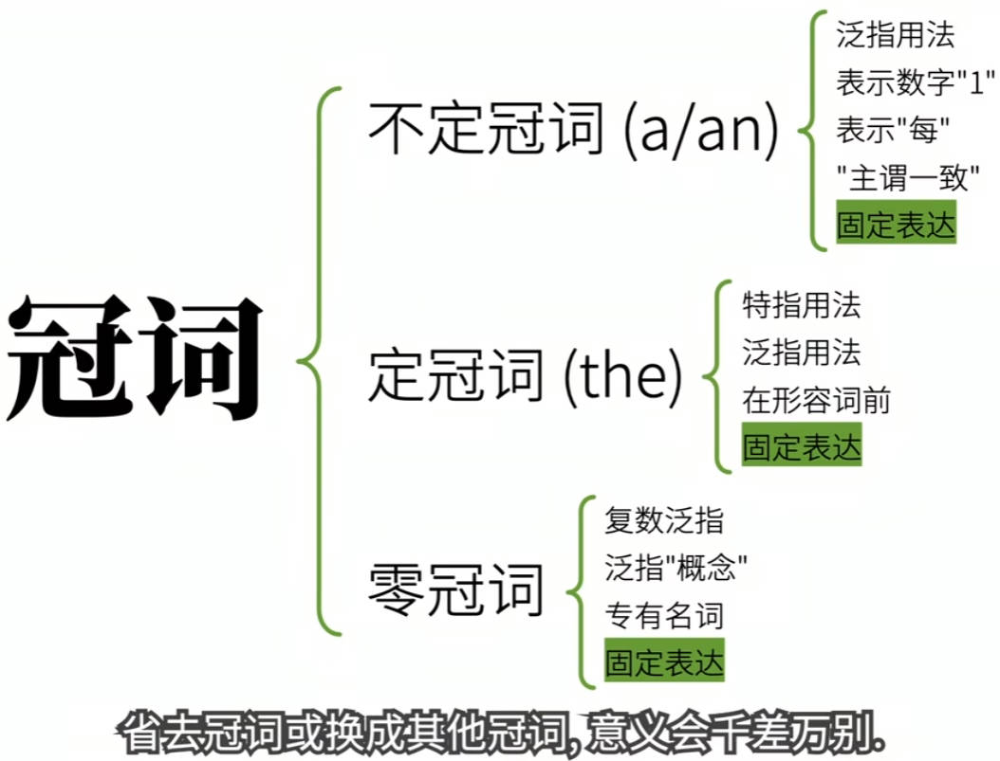

冠词a, an, the

春天？

a/the/0 spring

春天中文中没有，学英语者会本能分为三类

即不定冠词，定冠词，零冠词

🔴不定冠词（a/an）

🔵发音

a 用于辅音音素前≠辅音字母

an用于元音音素前≠元音字母

a rabbit /ə'ræɪt/

a university/ə,ju:nɪ'vɜː（r）sətɪ/

an apple/ən'æpl/

an hour /ən'aʊə(r)/

🔵 2.用法

⚫2.1泛指用法

2.1泛指某一个或一类人或物

⚪2.1.1泛指某一个人或物

eg.I saw a rabbit.

中文中因为没有英语不定冠词的说法

所以算是强行翻译为一只

因此I saw a rabbit.翻译成我看见一只兔子。

这里的一只并不强调数量上的一只，

而是泛指“某一只兔子”，是指兔子这个个物种中的某一只。所以这里我们还可以翻成我看见兔子了。

❗注意不能翻成I saw rabbit.

因为如果rabbit什么都不跟的话，有其他的用法与意义。

❗❗❗因为从某种意义上来说的话，它是属于零冠词，一个坑儿

ᐒ另外，如果我们第一次提到某个事物，

其实从某种意义上来说，也可以算是泛指。毕竟在第一次提到之前，说话者和听话者可能都不知道指的是具体的哪个人或物嘛。

我今天看到一只兔子，这只兔子跑的很快。

这一句话的中文前半句第一次提到某只兔子，可以说是泛指那么相应的就要用不定冠词。I saw a rabbit.

既然第一次提到一个兔子用a rabbit.

那么下半句应该用定冠词The rabbit.❗

⚪2.1.2泛指某一类人或物

A rabbit is smarter than a wolf.

一只兔子比一只狼聪明是有点儿奇怪，因为并没有明确指出是哪一只兔子比哪一只狼聪明。

实际上这里的a rabbit和a wolf 是泛指兔子和狼两类动物。

一旦泛指某一类事物就不好用“一个”“一只”来翻译，所以这句表达意思为“兔子比狼聪明”

这句话中是显而易见的泛指，不过这句话实际上也是有歧义的。

我们也的确可以理解为（某）一只兔子比（某）一只狼聪明。

而相反的

a rabbit is eating a carrot.

虽然句子结构与a rabbit is smarter than a wolf.非常相似

但是很明显就不是泛指而是说，某一只兔子在吃一根胡萝卜

而a rabbit is smart.

到底是泛指兔子这类动物聪明，还是说某一只兔子聪明呢？

这就得看具体语境以及你如何理解

所以虽然用不定冠词做泛指，语法上没有问题，但是更好的方式是咱们之后要说到的“零冠词”

Rabbits are smarter than wolves.

兔子比狼聪明

Rabbits are smart.

兔子聪明（兔子是聪明的动物）

⚫2.2表示数字“1”

I gave you a hundred carrots＝

I gave you one hundred carrots.

⚫2.3表示“每”

I eat 10 carrots a day.

＝

I eat ten carrots every day.

⚫2.4主谓一致

不定冠词还能影响主语的单复数，从而影响句意，比如

a teacher and video creator.

一位老师兼视频创作者（一个人）

a teacher and a video creator.

一个老师和一个视频创作者（两个人）

⚫2.5固定表达

have a good time

玩得开心

as a result

因此结果

in a hurry

匆忙的

all of a sudden

突然

此处的a 不可该也不可省

🔴定冠词

🔵1.发音

the

/ðə/用于辅音因素前

/ði:/用于元音因素前

the rabbit /ðə'ræbɪt/

the apple/ði:'æpl/

the university

the hour

定冠词

🔵2.用法

⚫2.1特指

定冠词主要功能就是特指表示某个或某些特定的人或物。也就是说话者和听话者都知道在讨论啥。

⚪2.1.1

再次提到的人或则物

如果说话双方再次提到某人或物，及双方都清楚说的是谁或什么，就要用定冠词the。

刚才咱们说不定冠词时说到一个中文例子，前半句第一次提到某个兔子用a,

而后半句因为再次提到，所以用the rabbit。

所以这句话，我今天看到这只兔子，这只兔子跑的很快。

I saw a rabbit. The rabbit ran fast.

a rabbit泛指不知道具体是哪一只,

The是特指，特指我上句话我看到的那只

如果你说I saw a rabbit.A rabbit ran fast.

英语母语者就会很疑惑，这到底是有两只兔子吗？很有可能引发歧义。

如请给我胡萝卜。

Please give me a carrot.

这就是泛指胡萝卜。

意思就是你有很多胡萝卜，你随便给我一根儿。

而Please give me the carrot.

就是特指对话双方都知道的那根胡萝卜，是一根特指的胡萝卜，别的我可不要。

⚪2.1.2用在序数词和形容词的最高级前

序数词和最高级限定的范围，所以也是特指。

The first rabbit第一只兔子

此时再用我表泛指就奇怪了，因为他这是指顺序排第一的兔子。

同样the biggest carrot.同样限定的，没有其他可能。

⚪2.1.3独一无二的名词前

在太阳系中，太阳，地球，月亮都是独一无二的事物。

所以The sun, the moon and the earth.

同样长城也是世界上独一无二的存在，所以是：The Great Wall

⚫2.2泛指

某些情况是可以的，只是稍微少见

比如西洋古典音乐器。

I like playing the piano.

你当然可以理解为特指，弹一架特定的钢琴。但从这个句子上下文看，我喜欢弹钢琴是说弹钢琴这一行为是在泛指弹钢琴这件事。

a也可以用来表泛指，但是这里的意义就会有所不同

A piano泛指可能有很多钢琴，随便找了一架弹。

也就是说咱们讨论的不再是弹钢琴这个音乐艺术行为或爱好了，而是单纯说在弹一架钢琴这一动作。

相似的还有play the guitar，played the violin,play the flute

ᐒThe computer has changed our way of life.

这句话做何理解呢？难道是特指某一个电脑改变了大家的生活？显然不对。

这里也是泛指，意思是computer作为整体一类工具，改变了我们的生活。❗

因为这样的句子就是很容易产生歧义。所以如果要泛指，一般推荐用之后要讲到的零冠词复数。

⚫2.3在形容词前

the➕形容词

表示一类人

如the rich富人

the poor穷人

The rich should help the poor.

⚫2.4固定表达

all the time 一直，总是

by the way顺便

out of the question不可能，没门

🔴零冠词

定义：名词前不用冠词的情况

主要作用：泛指

🔵1.复数泛指

a rabbit is smart.

可以泛指所有兔子聪明，但这种句子很容易被误解

因为视具体语境，既可以泛指兔子这类聪明，也可以泛指某一只兔子聪明

所以更好的方式是说

Rabbits are smart.

这里不是说几只兔子聪明，而是指兔子这类动物很聪明。

在定冠词部分我们也提及

The computer has changed our way of life.

可以泛指（所有）电脑改变了我们的生活

但是还是容易被误解

所以更好的方式为

Computers have changed our way of life.

✔️✔️相比之下，零冠词复数是非常准确有效的泛指，不容易引发歧义

❗不可数名词泛指，就是将这些不可数名词理解为不可以加s的复数形式即可。

Water is important.

水是重要的。

We breath air.

我们呼吸空气。

咱们照样可以把这理解为零冠词泛指

🔵2.泛指概念，是指脑中观念

如Summer ishot.Winter is cold.

夏天热，冬天冷

此处summer与winter是指夏季冬季，表季节这一概念

前面的表示我看到兔子，为何不可用I saw rabbit.?

因为rabbit很具象，因为说到兔子要不就是兔子这类动物，要不就特指一只兔子，很少用它表达抽象概念。

泛指，那么Summers are hot.当然也可以

☑️☑️所以，在表达泛指一类人或事物

出现最高的是复数泛指

I want to play football.

此处的play football泛指足球运动这一抽象概念，而不是某一个具体的足球或者足球这一类运动器具。

所以一般不说I want to play a football.

❗注意，在定冠词部分咱们提到过

Play the piano 也是泛指弹钢琴这一活动。

按理说用play piano的确也是可以的，

这是为什么会之前提到play the piano的用法比较特殊。

西洋古典音乐器才这样用，把乐器换成二胡。就变为play erhu就可

同样学科也是

I like geography.此处地理是泛指地理，泛指地理学科这一概念，也是零冠词的用法。

还有季节，星期，节假日的等。

in spring,in August,on Monday,

 on National Day

🔵3.专业名词

专业名词前，一般都没有冠词

如：Pepper Rabbit，一提到兔老爹,就想起了英语兔

🔵4.固定表达

From time to time.

Face to face.

Out of question毫无疑问

🔶🔶冠词分为不定冠词，定冠词和零冠词

🔶不定冠词多用于泛指，常用于泛指某一个人或是也可以泛指某一种类人或事物。

只不过，泛指一整类可能会引发歧义

此外，不定冠词还可以表示数字一和每等意思，而且往往会对主位一致造成影响。

🔶定冠词多用于特指某个或某些特定的人或物。说白了就是说话者和听话者都知道的是人或物

这也包含在交谈中第二次提及的人或物。

用序数词和最高级修饰的人或物，以及世界上独一无二的事物。

定冠词也会偶尔用于泛指，这算是比较少见的用法。

另外，定冠词用于某类形容词前表示一类人。这种用法把形容词转化为名词。

🔶零冠词最常见的是：复数名词泛指某一类事物，但是单数名词也可泛指某个概念。

此外，专有名词前多是零冠词。

最后，这三类冠词都有固定表达，

这些表达都有特定意义，省去冠词或换为其他冠词，意义会千差万别